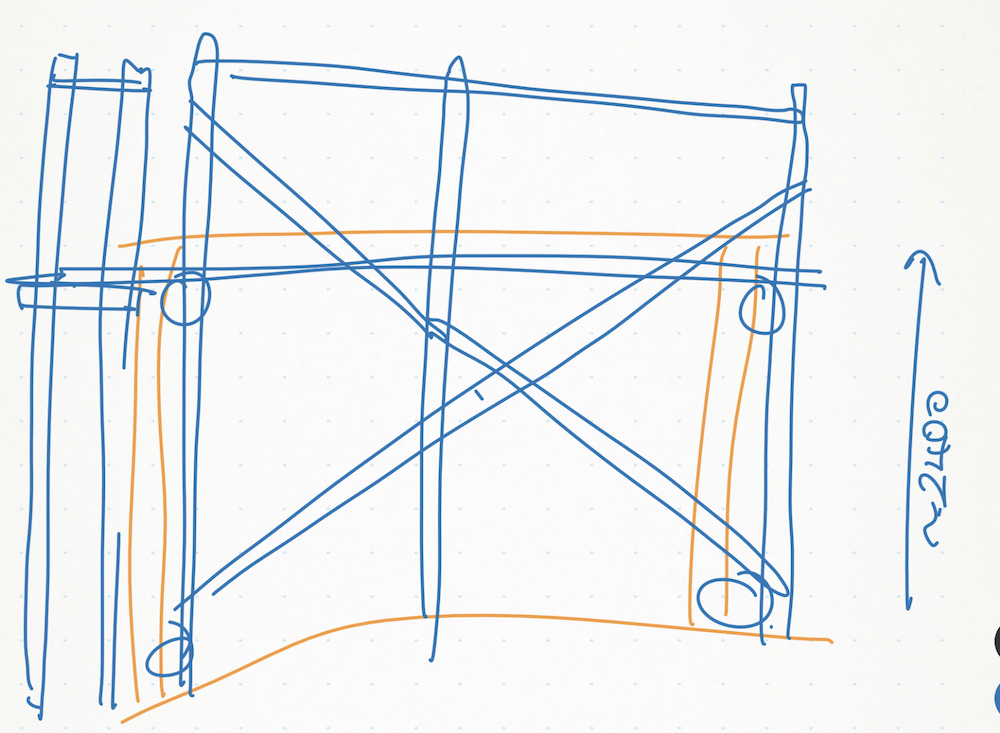

# Deck Scaffolding

Date: 2023-06-03

Status: accepted

## Context

I'm too cheap to get proper scaffolding, so I decided to assemble my own out from 2x4.

## Decision

Here's a rough sketch.

It's roughly 2.4m from where the floor of the shed is to the ground. My timber is 12FT so roughly 3.6m. That should be enough for the ground level. I'll worry about the higher level when we get there. There's still

The vertical stilts will be placed on concrete blocks. I'll use the ones with mounting brackets so that I can reuse them for a future project.

## Consequences

It's wood, we're entering the rainy season. There's a chance it'll go soft, but hopefully not in a matter of months.

I should be able to reuse the lumber somewhere. Nothing structural though. Either in the interiors, or blocking, or in future projects.
